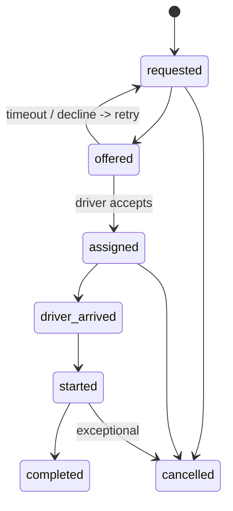
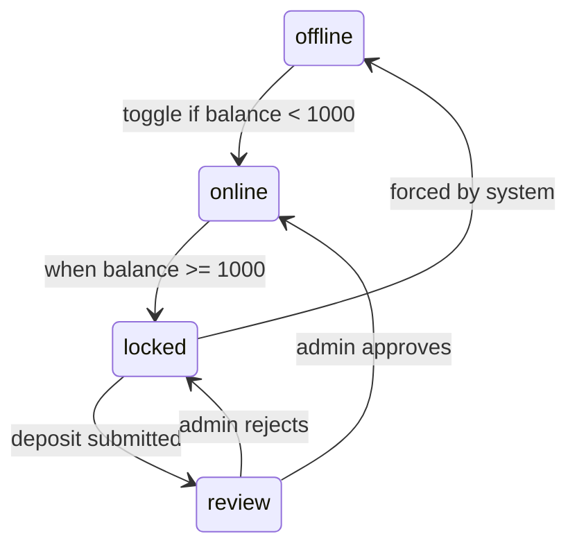

# Taxi Platform — Architecture v1.2  
**Date**: 2025-11-15  
**Status**: Foundation scaffolded; core features in progress

> **Scope**: Ride-hailing for **Tunisian licensed taxis** only. **Cash-only**; when a driver's **earnings ≥ 1000 TND**, the system **locks availability** until a **La Poste deposit** receipt is uploaded and **approved by admin**.

---

## 1) Context & C4 (text)

**Context (level 1)**  
- **Passengers (Clients)** on Flutter mobile app request rides.  
- **Drivers** (licensed taxis) on Flutter driver app accept and fulfill rides.  
- **Backend API (NestJS)** handles REST, data persistence (PostgreSQL + PostGIS), and business rules.  
- **Realtime/Dispatch Service (NestJS + Socket.IO)** manages presence, driver locations, dispatch offers, acknowledgments.  
- **Admin Web (Next.js)** for verification, audit, and deposit approval.  
- **Redis** used for ephemeral presence, queues (BullMQ), and rate limiting.  
- **PostgreSQL 16 + PostGIS** stores users, drivers, rides, earnings, deposits.  
- **Cloud storage (S3/DO Spaces)** for documents and deposit receipts.  
- **Google Maps Platform** for maps/geocoding/routing/distance.  
- **Firebase Auth** for phone OTP; system issues short-lived JWTs for API.  
- **Observability** via Prometheus/Grafana/Loki; alerts via Alertmanager.

**C4 Container diagram (ASCII)**

```
                    Internet
                        │
                ┌───────┴───────┐
                │               │
        ┌───────▼──────┐  ┌─────▼──────┐
        │ Mobile Client│  │ Driver App │
        │  (Flutter)   │  │  (Flutter) │
        └───────┬──────┘  └─────┬──────┘
                │               │
                │ HTTPS/REST    │ WebSockets
                │               │
        ┌───────▼───────────────▼───────┐
        │     API (NestJS/REST)         │
        │  Auth, Rides, CRUD            │
        └───────┬───────────────────────┘
                │
        ┌───────┴───────┐
        │               │
  ┌─────▼─────┐  ┌─────▼──────┐
  │PostgreSQL │  │   Redis    │
  │ + PostGIS │  │(queues/cache)│
  └───────────┘  └────────────┘
                        │
        ┌───────────────┴───────────────┐
        │                               │
  ┌─────▼──────┐              ┌────────▼────────┐
  │ Realtime/  │              │  Admin Web      │
  │ Dispatch   │              │  (Next.js)      │
  │(Socket.IO) │              └─────────────────┘
  └────────────┘

External: Google Maps, Firebase Auth, S3/Spaces, Prometheus/Grafana/Loki
```

---

## 2) Monorepo layout

```
/apps
  /backend          # NestJS REST API
  /realtime         # Socket.IO service
  /admin            # Next.js admin web
  /mobile_client    # Flutter client app
  /mobile_driver    # Flutter driver app
/packages
  /shared           # shared types, generated SDK, eslint configs
/infra              # Terraform (DO), Docker, Compose, Prometheus, Grafana, Loki
/docs               # this file, security.md, test_plan.md, runbooks
```

---

## 3) Data Model (DDL excerpt)

See `docs/schema.sql` for full DDL. Highlights:
- **IDs**: UUID v7 for time-sortable uniqueness.
- **Geo**: `pickup`/`dropoff` as `geometry(Point,4326)` with GiST indexes.
- **Ledger** tracks all driver earnings; **materialized view** `driver_balances_mv` provides fast balances.
- **Lock rule** enforced at application level; **partial index** accelerates balance queries for near-threshold drivers.

---

## 4) API & Socket Contracts

### REST (OpenAPI in `docs/openapi.yaml`)
Key endpoints:
- `POST /auth/verify-phone` (send OTP), `POST /auth/exchange-token`
- `GET /users/me`
- Driver onboarding: `GET /drivers/me`, `POST /drivers/documents`
- Rides: `POST /rides`, `GET /rides/{id}`, `POST /rides/{id}/cancel`, `POST /rides/{id}/start`, `POST /rides/{id}/complete`
- Deposits: `POST /deposits` (upload/metadata), `POST /deposits/{id}/approve|reject` (admin)
- Admin: `GET /admin/verification-queue`, `POST /admin/drivers/{id}/verify`

### Socket.IO Namespaces & Events

**Common envelope**: every event acked with `{ ok: boolean, error?: string, data?: any }`

#### Namespace: `/client`
| Event | Direction | Payload | Ack/Response | Notes |
|-------|-----------|---------|--------------|-------|
| `ride:request` | client→server | `{pickup: GeoPoint, dropoff: GeoPoint, idempotency_key: string}` | `{ok, data: {rideId}}` | Idempotent; triggers dispatch |
| `ride:status` | server→client | `{rideId, status: RideStatus, driver?: DriverInfo, eta_seconds?: number}` | (push) | Subscribe after request |
| `ride:cancel` | client→server | `{rideId, reason?: string}` | `{ok}` | Only if ride not started |

#### Namespace: `/driver`
| Event | Direction | Payload | Ack/Response | Notes |
|-------|-----------|---------|--------------|-------|
| `driver:online` | driver→server | `{available: boolean, location: GeoPoint}` | `{ok}` | Toggle availability; rejected if locked |
| `driver:location` | driver→server | `{lat, lng, accuracy, speed, heading, ts}` | `{ok}` | Server validates anti-spoof; throttle client-side |
| `ride:offer` | server→driver | `{rideId, pickup: GeoPoint, dropoff: GeoPoint, est_fare_cents?: number, expires_at: timestamp}` | (push) | 20s timeout; driver must ack accept/decline |
| `ride:accept` | driver→server | `{rideId}` | `{ok}` | Assigns ride; notifies client |
| `ride:decline` | driver→server | `{rideId, reason?: string}` | `{ok}` | Retry dispatch to next driver |
| `ride:arrived` | driver→server | `{rideId}` | `{ok}` | Status → driver_arrived |
| `ride:start` | driver→server | `{rideId}` | `{ok}` | Status → started |
| `ride:complete` | driver→server | `{rideId, price_cents: number}` | `{ok}` | Credits ledger; may trigger lock |
| `system:lock` | server→driver | `{reason: 'earnings_threshold', balance_cents: number, required_deposit_cents: number}` | (push) | Forces offline; blocks accept |

#### Namespace: `/admin`
| Event | Direction | Payload | Ack/Response | Notes |
|-------|-----------|---------|--------------|-------|
| `admin:monitor` | admin→server | `{subscribe: ['rides', 'drivers', 'deposits']}` | (stream) | Real-time dashboard updates |
| `deposit:decision` | server→admin | `{depositId, decision: 'approved'|'rejected', driver_id, amount_cents}` | (push) | Notify admin channel of decisions |

**Dispatch v1**:
- KNN search (PostGIS) within radius; tie-breaker by proximity then idle time.  
- Offer timeout: 20s; retry up to 2 drivers; fallback broadcast.  
- Rate-limit ride requests per user; deduplicate via idempotency key.

---

## 5) State Machines (Mermaid)

### Ride lifecycle


### Driver availability / lock


---

## 6) Security Controls (minimum)

- **Auth**: Firebase phone OTP → short-lived JWT (15m) + refresh. Device binding via device_tokens table.
- **AuthZ**: RBAC (client/driver/admin); resource ownership checks.
- **Input**: DTO validation (class-validator/zod), centralized sanitization.
- **Rate limiting**: IP+user scopes; stricter for `/auth`, `/rides`.
- **GPS anti-spoofing**: drop low-accuracy (>50m), speed jumps (>160km/h), teleport (>250m/2s), server-side road snapping.
- **Documents & receipts**: EXIF checks; random liveness prompts; manual review channel.
- **Secrets**: DO Secrets/Doppler; never in repo.
- **Logs**: no PII; security events to dedicated index.
- **Backups**: nightly Postgres snapshots (14d), object storage versioning; restore runbook.

---

## 7) Observability & SLOs

**Metrics**: `dispatch_latency_ms` p50/95, `ride_request_rate`, `ws_active_connections`, `driver_lock_count`, `db_q_latency`.

**Logs**: structured JSON, correlation IDs.

**Traces**: OpenTelemetry (HTTP + Socket).

**Dashboards**: Grafana; Alerts when p95 dispatch latency > 4s for 10m, DB errors > 1%, WS disconnect storms.

**SLOs (initial)**:
- API availability 99.9% (monthly).
- Dispatch p95 < 4s under 1000 concurrent drivers.
- Location ingest error rate < 1%.

---

## 8) Release Plan

- Environments: dev → staging → prod.
- Feature flags for risky features (e.g., broadcast dispatch).
- Migrations via TypeORM; zero-downtime using add-column → backfill → switch.
- Blue/green rollout for realtime; canary 10% traffic.

---

## 9) Risks & Mitigations

- **Receipt forgery** → EXIF check + random live photo + manual review + audit trail.
- **GPS spoofing** → heuristics above + server road-snap + driver score.
- **Ops outages** → managed DB/Redis, daily backups, multi-AZ where possible.
- **Store rejections (iOS)** → detailed review notes, test accounts, accurate permission texts.
- **Fraud (ride off-app)** → cancellation detection patterns, rider/driver scoring, cooldowns.

---

## 10) Implementation Status

### ✅ Complete
- Database schema (`schema.sql`) and migration (`1710000000000-InitialSchema.ts`)
- Docker/Compose setup (dev + prod)
- CI/CD workflows (lint, test, build, Docker, security scans)
- Admin Dockerfile (pnpm workspace-aware)
- Backend/realtime/admin/mobile scaffolds with placeholder modules
- OpenAPI spec with core endpoints + new schemas (Vehicle, Document, Deposit)
- Socket.IO event contracts documented

### 🚧 In Progress
- Backend services implementation (auth, rides, deposits still stubs)
- Realtime dispatch logic (gateways exist but dispatch/GPS validation incomplete)
- Admin UI features (verification, deposit approval, dashboards)
- Flutter mobile features (auth, ride flows, earnings lock, GPS tracking)
- SDK generation from OpenAPI

### ⏳ TODO
- Full RBAC implementation with role guards
- Earnings lock enforcement + ledger credits
- GPS anti-spoofing server-side validation
- Receipt/document EXIF validation
- Push notifications (FCM integration)
- Comprehensive test coverage (unit/integration/e2e)
- Observability stack (Prometheus/Grafana/Loki)
- Load testing (k6 scripts)
- Production deployment runbooks
- SDK auto-generation pipeline

---

## 11) Repo Contracts & Rules

Follow `.cursorrules` at repo root.

Any API change must update OpenAPI + regenerate SDK `/packages/shared`.

Critical flows must have tests before merge.

**SDK Generation Note**: Currently manual; automation via `openapi-generator-cli` or similar to be added in `/packages/shared/scripts/generate-sdk.sh`.

